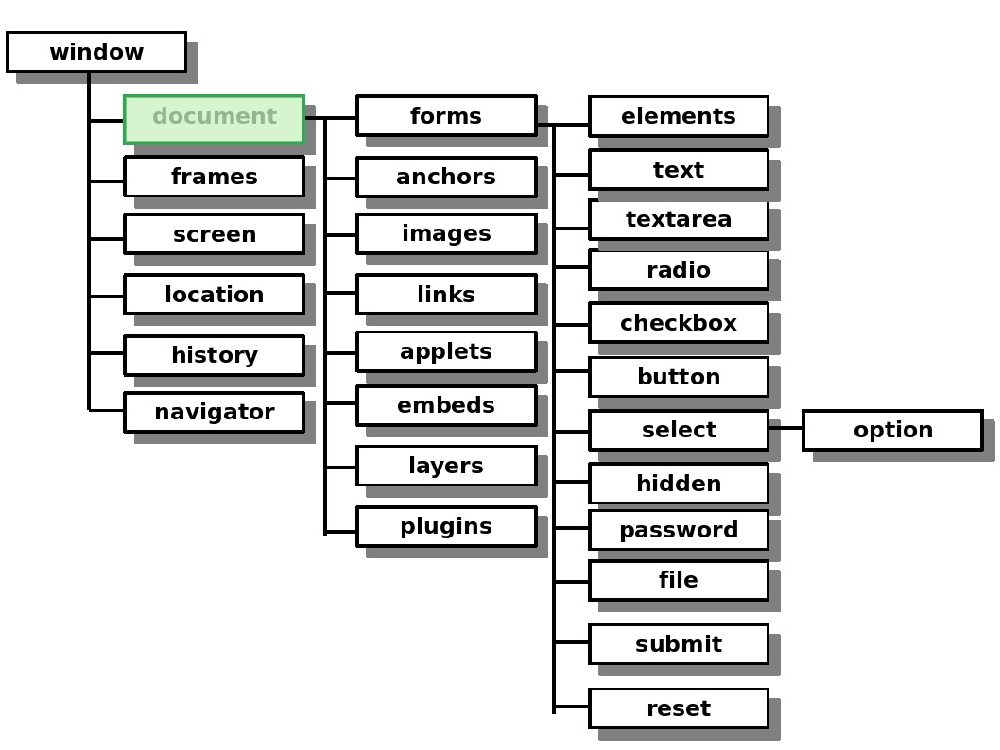

# EL OBJETO DOCUMENT
## 1 ¿Qué es un objeto?

Un objeto es una colección de propiedades, y una propiedad es una asociación entre un nombre (o clave) y un valor.

### 1.1 Y el objeto document, ¿Qué es?

Con el objeto document se controla la página web y todos los elementos que contiene. El objeto document es la página actual que se está visualizando en ese momento.

## 2 ¿Dónde está situado?

Document depende directamente del elemento raíz en la jerarquia de objetos, es decir, de 'window'. También puede depender del objeto [frame](https://desarrolloweb.com/articulos/1147.php) en caso de que la página se está mostrando en un frame.

## 3 MÉTODOS
### 3.1 OBSOLETOS
**3.1.1 Capture Events**

Servía para especificar que tipo de eventos tiene que recoger el documento.

    document.captureEvents();    

Actualmente se recoge un elemento y se le añade un evento: 

    elemento.addEventListener(evento, función, flujo);    

**3.1.2 Handle Event**

Recoge un evento concreo para realizar una serie de procesos o acciones cuando el evento indicado se produzca.
Ahora este método pertenece al objeto eventListener.

    document.handleEvent(event);    

**3.1.3 Release Events**

Hace que el documento deje de capturar un evento concreto.
Ahora pertenece al objero 'window'.

    document.releaseEvents(event);    

**3.1.4 Route Event**

Solía usarse para mandar un evento al siguiente objeto que solicitó carturar eventos (handleEvent).
Este método pasó a ser del objeto 'window'.

    document.routeEvent();

**3.2.2 Get Selection**\*

Devuelve un objeto [Selection](https://developer.mozilla.org/es/docs/Web/API/Selection) que representa el texto que se ha seleccionado.

    document.getSelection();    

### 3.2 ACTUALES
**3.2.1 Open, Write y Close**

Estos tres métodos van de la mano.

- Con *open* abrimos el documento a la escritura.

- Con *write* escribimos en el documento.

- Con *close* cerramos el documento.

    document.open();     
    document.write(text);    
    document.close();    

**3.2.2 Get Element By Id**

Devuelve